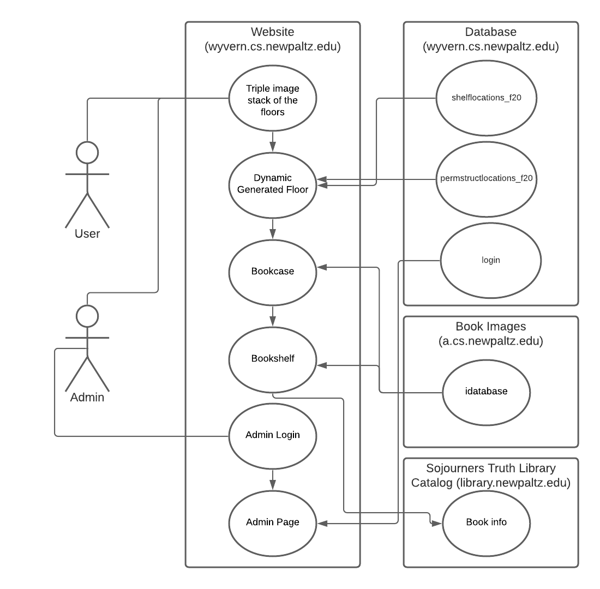
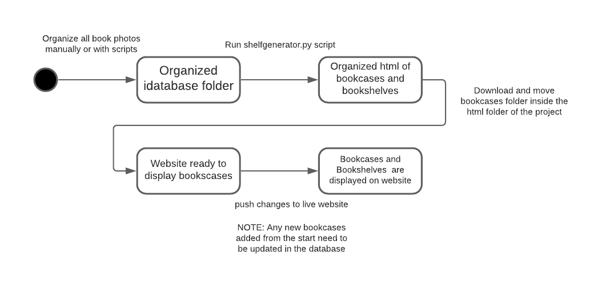
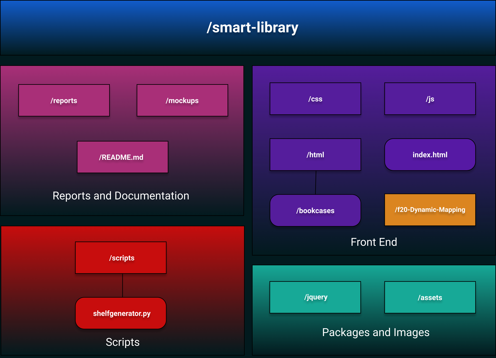
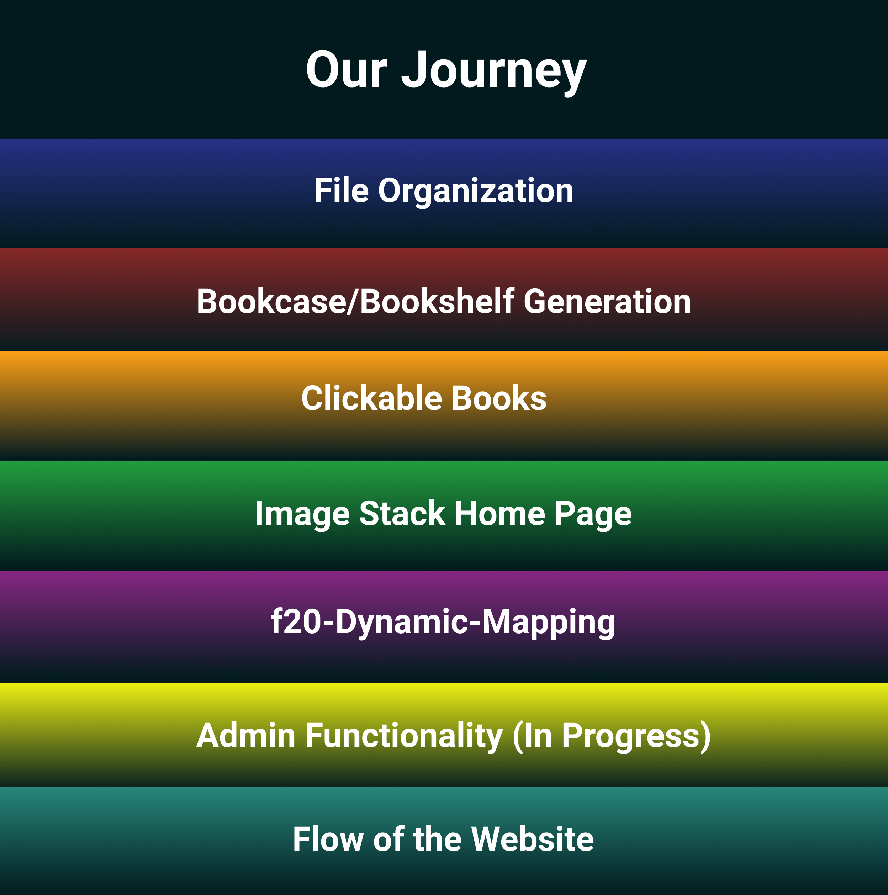
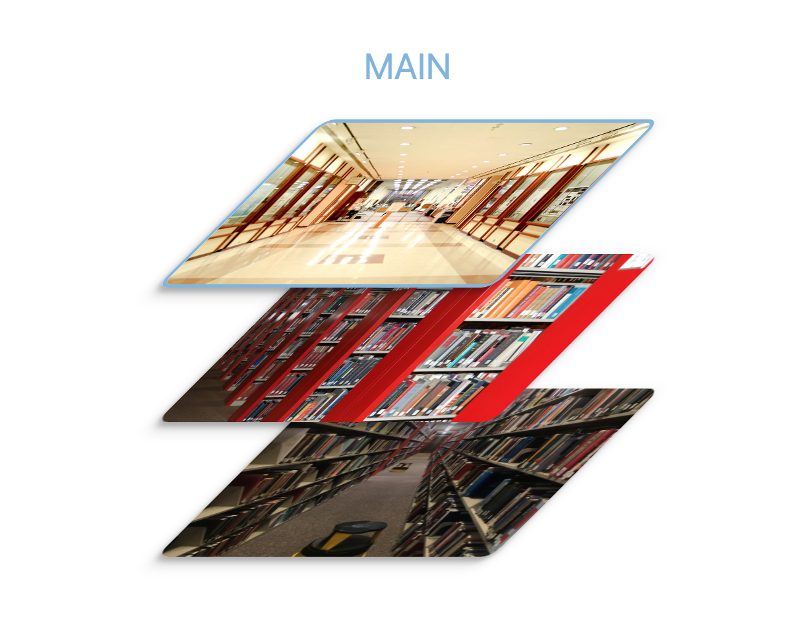
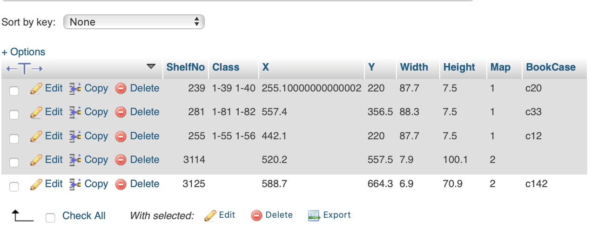
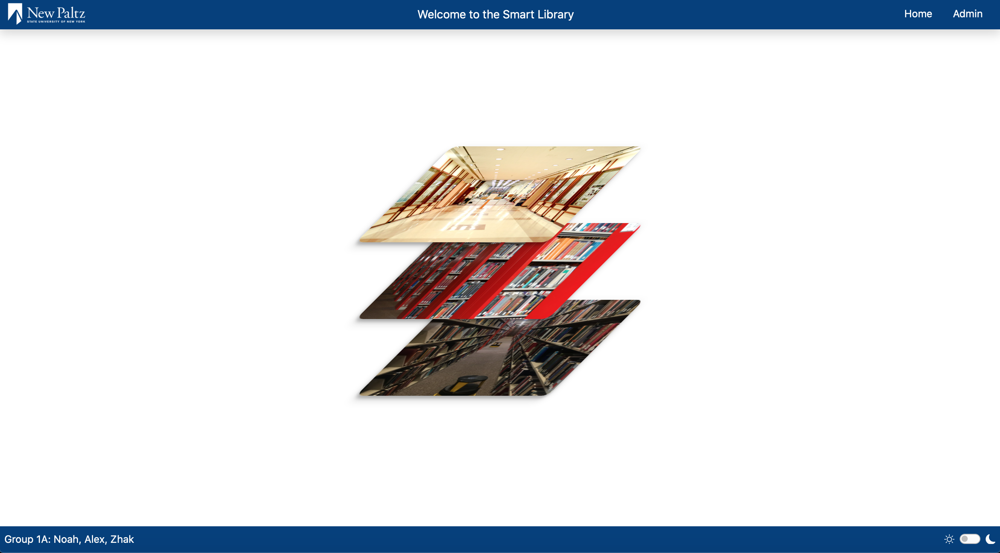
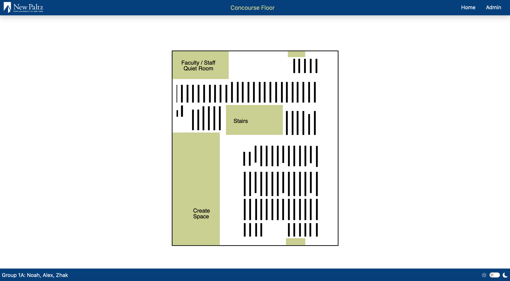
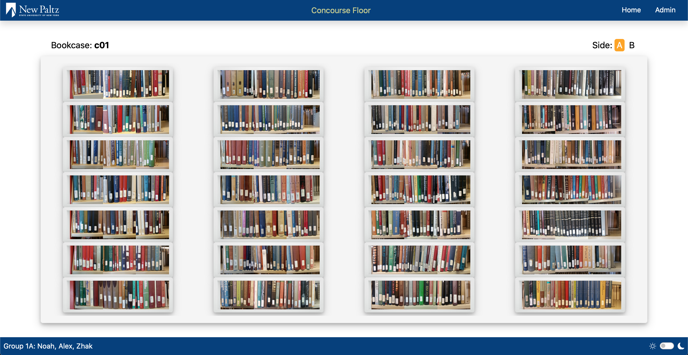
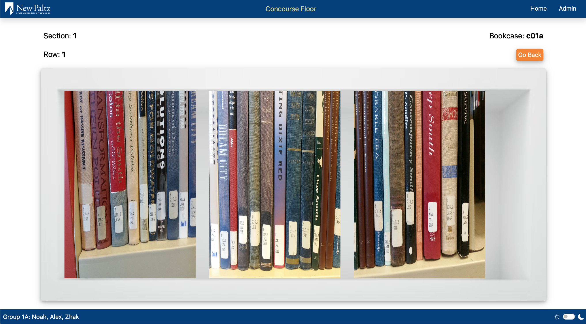

# Spring 2021 Projects


This repository documents our project done for **CPS485**.

**Personal Information:**

        Noah Franklin     (franklin3@hawkmail.newpaltz.edu)
        Alexandra Maceda  (macedaa1@hawkmail.newpaltz.edu)
        Yitzhak Alvarez   (alvarezy3@hawkmail.newpaltz.edu)

**Professor:** Hanh Pham    

**Class Start Date:** Jan 20, 2021

**Class End Date:** May 5, 2021

# Project Description

The Smart Library is a large project with the goal of creating a library exeprience online that mimics the experience in person. There are many different parts to this project ranging from a robot taking pictures, Neural Networks, Image processing, file organization, and the Smart Library website. This project has been worked on in previous semesters and we were tasked with improving the file organization and the website aspect.

# Links and Locations

## Website

URL: http://cs.newpaltz.edu/p/s21-01/smart-library/

Host: @wyvern.cs.newpaltz.edu

Location: /var/www/projects/s21-01/html/smart-library

## Book Images

Host: @a.cs.newpaltz.edu

Location:  /var/www/html/vlib/idatabase

**NOTE:** You will need to be connected with the VPN in order to access the "a" server where these book images are located. Also make sure you dont connect to the website with https protocol or the images might not load.

# Prerequisites

## Local 
- **Git** (to clone this repository and push changes to a web server)
- **Live Share** (VSCode Extension to run a local web server to view the website)

## Live
- **All Local Prerequisites**
- **Cisco AnyConnect Secure Mobility Client** (VPN needed to view the images on the live website and to connect to the "a" server)

# Instructions

Local
1. Install the prerequisites
2. Clone this repository or get it from the professor
3. Right click index.html and "Open with Live Server"

Live (wyvern)
NOTE: Make sure a file called "connect.php" is located inside f20-Dynamic-Mapping/Admin folder with the following code and replace  `<DATABASE USERNAME>`,  `<DATABASE PASSWORD>`,  and `<DATABASE NAME>` with the correct info. This file is responsible for establishing a connection to the database for the dynamic rendered map and login features. I was not able to get this to work on a local environment as im not sure how to access the database on the username and password protected wyvern server. The web server hosting this website should have connect.php with our database info.

```php
<?php
   
    $servername = "localhost";
    $username = <DATABASE USERNAME>;
    $password = <DATABASE PASSWORD>;
    $database = <DATABASE NAME>;

    $conn = new mysqli($servername, $username, $password, $database);

    // Check connection
    if ($conn -> connect_error) 
    {
      
        die("Connection failed" .$conn->connect_error);
      
    }
?> 
```
**NOTE:** Running the website locally will not display the black rectangular shelves on the dynamic map for each floor, push changes to the live website if you want to view them. 

# Design



# Developer's Guide (Components)

## Map of Files





## 1: File Organization 

Our first task was to organize all the book images of the library taken from previous semesters. The folders and images were organized in different ways (if at all) because different students were responsible with different sections of the library. We started by using FileZilla and the VPN to remotely move and rename folders to follow a consistent naming format so we could easily display this on the website later. The following format was provided by the Professor...

Format: 

        vlib/idatabase/number-name/shelfnumber/side/sectionnumber/rownumber/imagefiles

Example:

        vlib/idatabase/3-tahir/c46/a/section1/row1/IMG_0967

After manually organizing all the folders up to the side level, we decided to make some shell scripts to help with creating, making, and moving files and folders for the sections, rows, and images. The scripts we used can be found in the scripts directory of this repository.

### Instructions for the scripts

1. Use FileZilla to move the appropriate script inside a shelf number folder you want to organize (so you should be seeing the folders "a", "b", and the script file)
2. SSH into the "a" server to run the script file (Example: ./alex.sh)
3. Check and refresh to see if it works. 

## 2: Bookcase/Bookshelf Generation

Now that we fully organized the idatabase folder, we now needed to make another script that will generate bookcase and bookshelf html files for the entire library in an organized fashion. We first started by designing what the bookcase and bookshelf page would look like which can be found inside the html directory of this repo under bookCase.html and bookShelf.html respectively. Then we used python to make a program that will loop through every folder/file in the idatabase folder with the use of recursion. Then by making the program create html files and write the appropriate html code as it loops through all the files and folders, we now have all the html we need for the library. This python script can be found in the scripts directory of this repository.

### Instructions for `shelfgenerator.py`

1. Use FileZilla to create a bookcases directory inside the idatabase folder (if this is already done make sure to delete everything inside the bookcases directory before running the script)
2. Move the `shelfgenerator.py` script into the idatabase folder
3. SSH into the "a" server to run the script file (./shelfgenerator.py)
4. Wait for the script to finish and all the generated html should be located in the bookcases folder

### Output

The script output format is as follows:

        /bookcases/shelfnumber/side/sectionnumber/rownumber.html
        
The bookcase html is located inside each shelfnumber under a.html and b.html for side a and side b respectively of a bookcase.

The bookshelf html is located inside the a and b folders of the shelfnumber and organized per section and row

Further explanation with example:

- inside bookcases the c01 folder is the bookcase
- inside the c01 folder is a.html and b.html which is the a side and b side of  the c01 bookcase (This is what the bookcase page will look like)
- inside the c01 folder is a and b folders containing the sections of the bookcase for the respective side
- inside the section folders are row html files that display the appropriate row of the bookcase (This is what the bookshelf page will look like)

## 3: Clickable Books 

For future use when the CLARA/ANN system is more developed, the Professor wanted us to demonstrate a way for the image to have clickable sections which will link to the sojourers truth library page to show more info about the book. This search also has to be done with a book call number as that will be provided later on when CLARA processes an image. We started by creating a map of clickable columns in an image. These columns when clicked will run a function to open a new page on the sojourners truth website to show more info about the book. The link is created by taking a book call number variable and adding it into the search url. This book call number variable is currently hard coded in but it can easily be changed to query a database to get all the book call numbers for a image. All of this was added to the `shelfgenerator.py` script

Search URL:

    https://suny-new.primo.exlibrisgroup.com/discovery/fulldisplay?docid=alma990002702100204844&context=L&vid=01SUNY_NEW:01SUNY_NEW&lang=en&search_scope=MyInstitution&adaptor=Local%20Search%20Engine&tab=LibraryCatalog&query=any,contains,<bookcallnumber>&offset=0

 Where `<bookcallnumber>` is the variable containing the book call number

This is the getBookInfo function that is ran when a column is clicked

Located in **/js/navbar.js**

```js
function getBookInfo() {
  callNumbers = ["F294.S2 J64 1996", "F294.S2 S58 2014", "F311 .D66"];
  callNumber = callNumbers[Math.floor(Math.random() * callNumbers.length)];
  callNumberFormated = callNumber.replaceAll(" ", "%20");
  console.log(callNumberFormated);
  query =
    "https://suny-new.primo.exlibrisgroup.com/discovery/fulldisplay?docid=alma990002702100204844&context=L&vid=01SUNY_NEW:01SUNY_NEW&lang=en&search_scope=MyInstitution&adaptor=Local%20Search%20Engine&tab=LibraryCatalog&query=any,contains," +
    callNumberFormated +
    "&offset=0";
  console.log(query);
  window.open(query, "_blank");
}
```

**Note:** Some functions for the website are located inside this navbar.js file, for some reason when we were creating additional javascript files for each component, the function wouldnt be available. Putting functions inside navbar.js for some reason always made the function available to the entire website 

## 4: Image Stack Home Page

The project proposal and Professor wanted the home page of the library to display an image stack of the three library floors. The floors consist of the Main, Concourse, and Ground floor. With some weird css we managed to get it to look very similar to how it looked in the documentation while still being clean and responsive. Currently mousing over each floor will highlight it with the appropriate color and display text of the floor name overhead 


Home page image stack

## 5: f20-Dynamic-Mapping

This part of the project was already completed by previous semesters and the documentation for it is inside the f20-Dynamic-Mapping folder. We took the part of the code responsible for the dynamic mapping to make our **(main, concourse, and ground.html)** files. We then had to connect this map to our generated bookcase html. We did this by copying the database from previous semesters and adding a new column called BookCase. We then manually added the book case number for each shelf that we have in the idatabase folder. Then we finished it by editing the php files that generate the black rectangular shelves located in f20-Dynamic-Mapping **(mainFloorDisplayer.php, concourseDisplayer.php, groundDisplayer.php)**. By removing the href and adding a onclick method to load the correct html file from the /bookcases folder. 

Located in **/f20-Dynamic-Mapping/mainFloorDisplayer.php**

```php
$string = "<svg width=&ldquo;5&rdquo; height=&ldquo;20&rdquo;><a onclick=getBookCase('" .$list[$i]['Bookcase'] . "','a')><rect id =\"" . $list[$i]['ShelfNo'] . "\" width=\"" . $list[$i]['Width'] . "\" height=\"" . $list[$i]['Height'] . "\" x=\"" . $list[$i]['X'] . "\" y=\"" . $list[$i]['Y'] . "\" style=\"cursor:pointer;\"/></a></svg>";
```

Located in **/js/navbar.js**

```js
function getBookShelf(dir, row) {
  $(".main").load("./html" + "/" + dir + "/" + row + ".html");
}
```

### Attaching the bookcases to the website

1. Take the bookcases folder generated by the `shelfgenerator.py` script and move it into the html folder of the project
2. Optional: If any new bookcases are added, you will need to go into the database and update the appropriate shelf with the correct bookcase number. You can do this as follows...
       
        1. Find the ID of the shelf by right clicking and inspecting element on the correct rectangular shelf on the map and finding the id number in the <rect> html
        Example: 
        <rect class="1-55 1-56" id="255" width="7.5" height="87.7" x="442.1" y="220" style="cursor:pointer;"></rect>
        Where 255 is the id of this shelf
        2. Login to the database using phpmyadmin on the new paltz cs web server (cs.newpaltz.edu/phpmyadmin)
        NOTE: Login info as well as a database export sql file will be available on the wyvern web server where the website is hosted (/var/www/projects/s21-01)
        3. Open the p_s21_db database and go into the shelflocations_f20 table
        4. increase the number of rows you can see to max then search the id number from step 1
        5. Edit the table entry containing the id of the bookshelf and add the correct bookshelf number to the BookCase attribute that should be blank. In this case 255 corresponds to bookshelf c12


3. The dynamic map should now link to the correct bookcases and bookshelf pages.

## 6: Admin Functionality *

This is starred because it is not fully implemented yet. Currently login info can be checked but upon a successful login, the admin page **(/f20-Dynamic-Mapping/Admin/adminPanel.html)** will not open because browsers by default block pop-ups not generated by user action or event. Since the admin page load is triggered inside the php **(/f20-Dynamic-Mapping/Admin/login.php)** to check for the right login, this is considered not a user action and the page is blocked. This can be worked around if you allow all popups from the website, but a better solution would probably be to add a login session and have a admin button appear after you login. This way the admin button will be a user action and the admin page should display in a new tab. Another issue with the admin part is that if you have the direct link, any user could view the page. A solution for this would be to implement a route guard for the admin page.  

## 7: Flow of the Website

Our website starts from the index.html page where four `<div>` tags are located.
These `<div>` tags are populated using jquery **(index.js)** to display the right html files. So initially the navbar **(navbar.html)**, homepage of the image stack **(home.html)**, and footer **(footer.html)** are loaded. Clicking the "Home" text in the navbar will bring you back to this initial state and clicking the "Admin" text will display a modal **(loginModal.html)** to login and if successful open the admin page. 


home page

Clicking any of the floors will replace the hompage image stack with the correct dynamically rendered floor **(main,concourse,ground.html)**. 


dynamic map

From there you can click any bookcase (black rectangular shapes) and if there is a bookcase page for it, the dynamically rendered floor will be replaced by the bookcase page (For Example: /bookcases/c01/a.html is loaded when you click on the c01 bookcase). The user will then see the bookcase page populate with all the images of the bookshelf (this can take some time) and switch the bookcase side by click on A for side a or B for side B. 


bookcase page

They can then click on a bookshelf to replace the bookcase page with the correct bookshelf page (For Example: /bookcases/c01/a/section1/row1.html is loaded when you click on the first bookshelf (top left) on the c01 bookcase). 


bookshelf page

To finish it, you can then click a column on the book image to open a new page displaying more info about the book. The Bookcase and Bookshelf pages will display info about the bookcase number, section, and row accordingly and buttons to go back or the home button can be used to navigate.


